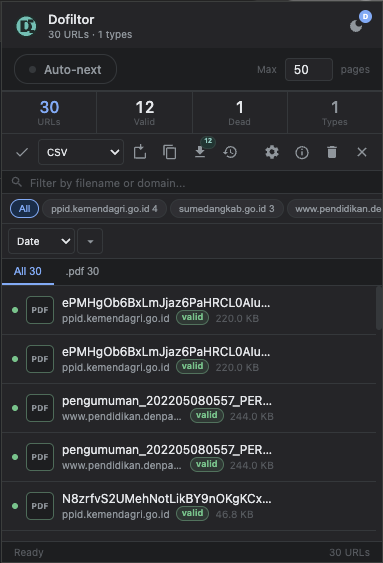
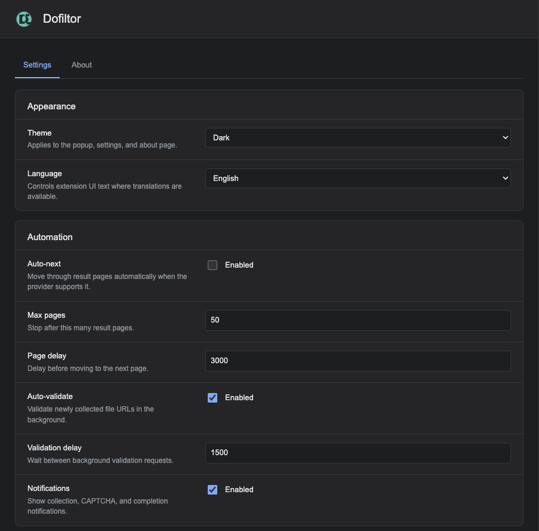
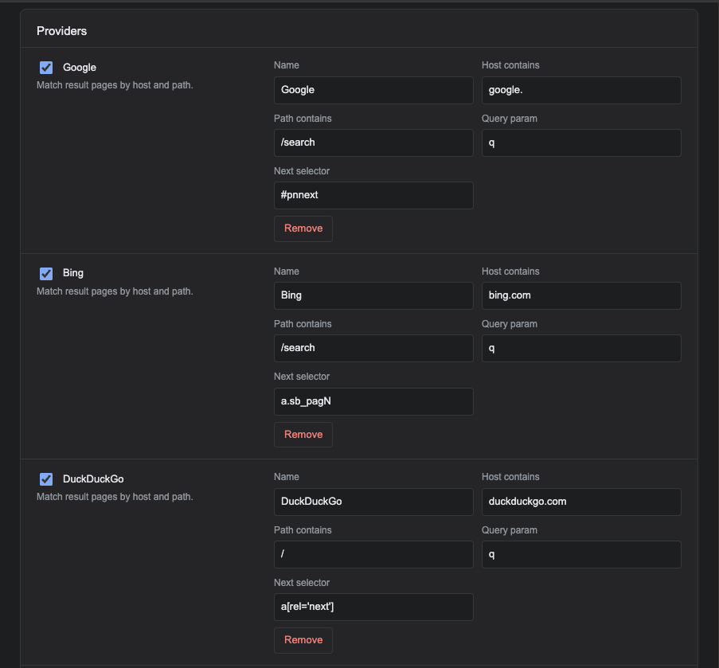
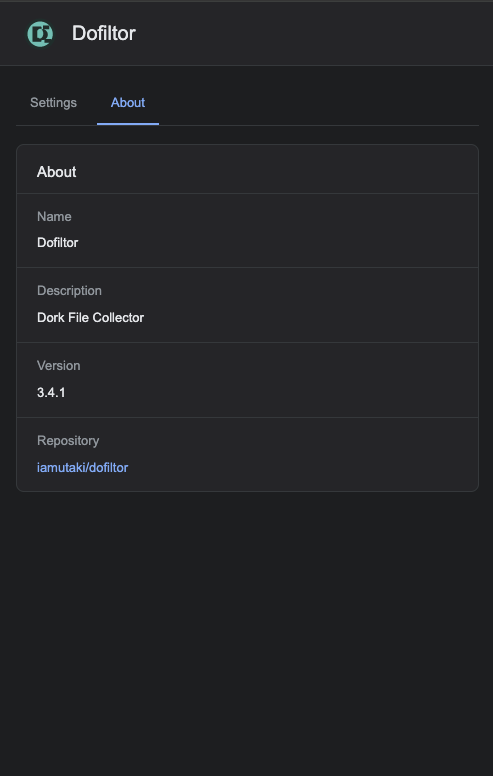

<p align="center">
  
</p>

<h1 align="center">Dofiltor</h1>
<p align="center"><strong>Dork File Collector</strong></p>

<p align="center">
  
  
  
  
  
</p>

<p align="center">A browser extension for collecting file URLs from configurable dork/search result providers.</p>

---

## Screenshots

<p align="center">
  
</p>

<details>
<summary>See more screenshots</summary>

<p align="center">
  
  
  
</p>

</details>

---

## Features

| Feature | Description |
|---|---|
| **Multi-provider** | Google, Bing, DuckDuckGo, Yahoo, Yandex - with custom host rules |
| **Capture extensions** | PDF, XLSX, DOCX, CSV, PPTX, TXT, and more - fully configurable |
| **Batch download** | Download all valid files in one click |
| **Row validation** | Per-row status: `valid` , `dead` , `pending` |
| **Automation** | Auto-next page, configurable delays, auto-validation, notifications |
| **Theme** | Light / dark / auto - synced across popup and Settings |
| **Multi-language** | English & Bahasa Indonesia |

---

## Installation

**Option A - CRX (recommended)**

1. Download the `.crx` file from the [latest release](https://github.com/iamutaki/dofiltor/releases/latest) (always points to the newest tag)
2. Open `chrome://extensions` in your browser
3. Drag and drop the `.crx` file onto the page

[](https://github.com/iamutaki/dofiltor/releases/latest/download/dofiltor.crx)

**Option B - Load unpacked**

1. Clone or download **Source code (zip)** from the [latest release](https://github.com/iamutaki/dofiltor/releases/latest)
   ```bash
   git clone https://github.com/iamutaki/dofiltor.git
   cd dofiltor
   git checkout "$(git describe --tags --abbrev=0)"
   ```
2. Open `chrome://extensions` in your browser
3. Enable **Developer mode** (toggle in top-right)
4. Click **Load unpacked** and select the repo folder

[](https://github.com/iamutaki/dofiltor/releases/latest)

### Side panel (Chrome 114+)

Click the toolbar icon to open Dofiltor in Chrome’s **side panel** (right edge of the window). Unlike the old toolbar popup, the panel stays open while you click through Google/Bing results—handy for auto-next and watching collected URLs update in real time. Resize the panel edge to make it wider or narrower.

---

## Translations

Dofiltor supports **English** and **Bahasa Indonesia**. To add a language, see [**_locales/README.md**](_locales/README.md).

1. Copy `_locales/en/ui.json` → `_locales/<code>/ui.json` and translate values (keep keys).
2. Add `_locales/<code>/messages.json` for the extension name/description.
3. Register the code in `I18N_SUPPORTED` inside `i18n.js` and add it to the language list in `options.html`.
4. Run `node scripts/check-locales.mjs` before opening a PR.

Only the active locale (plus English fallback) is loaded at runtime — not every language at once.

**Chrome Web Store ZIP** (no `key.pem`, no `.git`, no dev scripts):

```bash
chmod +x scripts/build-store-zip.sh
./scripts/build-store-zip.sh
# → dofiltor-store.zip
```

---

## License

MIT - [iamutaki](https://github.com/iamutaki)
